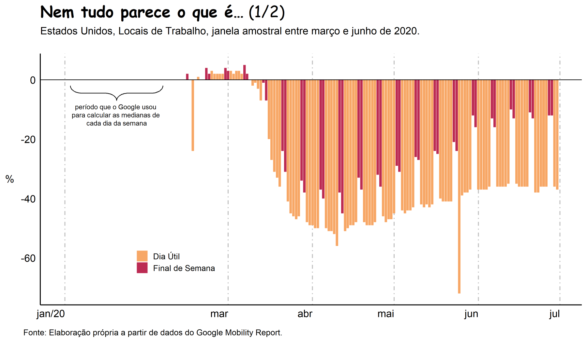
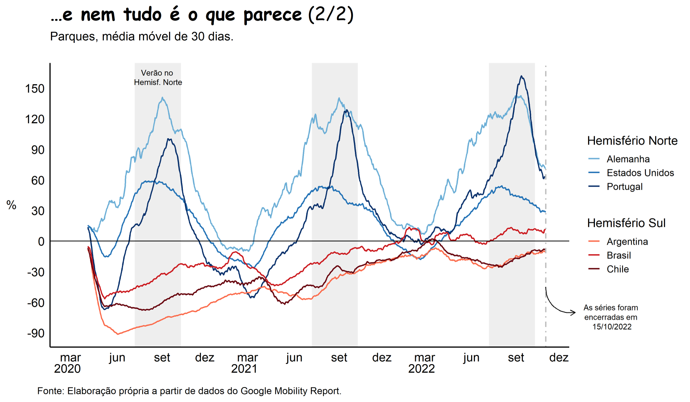

<!-- README.md is generated from README.Rmd. Please edit that file -->

#### Introdução

Este repositório contém o código usado para a produção das figuras
presentes no texto ‘Não deixe que os dados te enganem!’ (abaixo),
publicado no dia 03 de janeiro de 2024. Um arquivo em `.ppt` com as
imagens está disponível para download. Foram utilizados principalmente
pacotes associados ao `tidyverse`, além de outros pacotes extras, como
`extrafont`, `scales` e `countrycode`.

------------------------------------------------------------------------

# Não deixe que os dados te enganem!

Dizem por aí que um conjunto de dados é uma ‘**coleção de fatos**’,
talvez em um sentido da palavra ‘fato’ próximo de “ação ou coisa feita,
ocorrida ou em processo de realização” (definição lá do Oxford
Languages). **Mas isso não significa que a sua interpretação deva ser
direta** - ou seja, sem que alguém pense na natureza e no tipo dos dados
antes de tirar alguma conclusão. Um exemplinho com o Google Mobility
Report vai deixar essa ideia mais clara.

### Relatórios de Mobilidade: alguns cuidados

Durante a pandemia, o Google resolveu
[disponibilizar](https://www.google.com/covid19/mobility/) os chamados
‘dados de mobilidade’ com intuito de “informar sobre o que mudou em
função das políticas de enfrentamento à COVID-19”, principalmente
lockdowns. Nada mais eram do que séries de tempo segmentadas por
***região*** *e **categorias de localidade*** (Varejo e Lazer, Mercados
e Farmácias, Parques, Estações de Transporte Público, Locais de Trabalho
e Áreas Residenciais), em que os números representavam variações
percentuais do nível de atividade em relação período pré-pandemia. **No
total, quase 80 mil séries foram produzidas**, representando a
combinação das 6 categoriais para cada uma das 13 mil regiões
selecionadas (entre países, estados, municípios e macrorregiões)!

Logo de cara vale a pergunta: **o que é o ‘nível pré-pandemia’?** Ou,
falando de forma mais técnica, qual é a base de comparação? Aqui os
detalhes já começam a ficar importantes. Isso porque **o Google definiu,
em cada série, um nível pré-pandemia para cada dia da semana!** *O
cálculo em si é a mediana das observações dos valores brutos* (a
princípio quantidade de pessoas, com exceção de áreas residenciais,
medido em horas), *para cada dia da semana, nas cinco semanas entre
03/jan/2020 e 06/fev/2020*. Seguindo esse raciocínio, o valor base para
segunda-feira, por exemplo, é a mediana dos valores brutos registrados
nos dias 03, 10, 17, 24 e 31 de janeiro de 2020 - e não a média ou
mediana do período inteiro, como tenderíamos a pensar. A metodologia faz
com que um analista tenha que ter certos cuidados na interpretação:

- **O mesmo número de pessoas em dois dias seguidos pode gerar variações
  percentuais diferentes simplesmente porque a base de comparação vai
  ser diferente!** Se as mesmas 100 pessoas visitarem áreas de ‘varejo e
  lazer’ na terça e quarta, mas a mediana no período de coleta para
  esses dias for de 60 e 70 pessoas, respectivamente, então as variações
  percentuais serão de 67% e 43%. *Quem for olhar pode acabar achando
  que tem menos gente indo se divertir de um dia para o outro, o que não
  é verdade.*

- **Outra implicação é a de que dados de dias úteis tendem a ser
  diferentes dos registrados aos finais de semana.** Se em tempos
  normais poucas pessoas já visitam locais de trabalho aos sábados e
  domingos, por exemplo, então a queda percentual em função de lockdowns
  tende a ser um valor naturalmente menor (gráfico 1). *Isso significa
  que o impacto das políticas contra Covid é menor nos finais de
  semana?* A resposta é *não*, pelo mesmo raciocínio anterior.

  

<!-- -->

- **Até o clima pode induzir à má interpretação dos dados!** Como o
  período base de coleta é entre janeiro e fevereiro, estamos falando
  então do inverno no hemisfério norte, onde costuma ser bastante frio.
  Esse é o momento em que as pessoas naturalmente tendem a visitar
  parques com menor frequência, o que acaba resultando em uma mediana de
  valor próximo aos mais baixos que podem ser registrados. *Logo, as
  variações percentuais tendem a ser números mais elevados nessas
  regiões; de forma simétrica, o inverso ocorre onde é verão* (gráfico
  2, de linhas, ainda que não seja o mais indicado). Mais uma vez: isso
  não significa que nesses lugares houve aumento significativo de
  atividade. Alemanha, Estados Unidos e Portugal só deram ‘sorte’ de
  estarem mais frios do que Argentina, Chile e Brasil durante janeiro!

  

De certa forma, o Google deixa bem claro as limitações dos dados. No fim
das contas, esse textão todo é só para dizer uma coisa: cuidado com as
conclusões precipitadas. Dados podem representar fatos mas isso não é
condição suficiente para achar alguma coisa logo de cara. Nem tudo é o
que parece.
